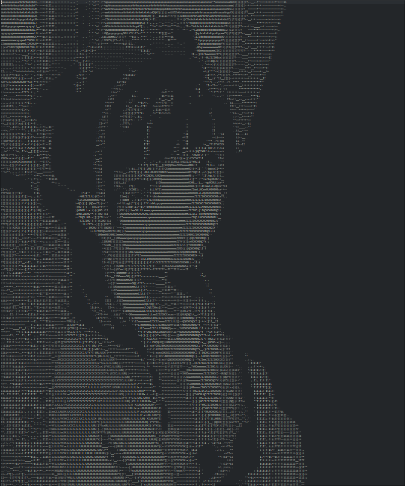
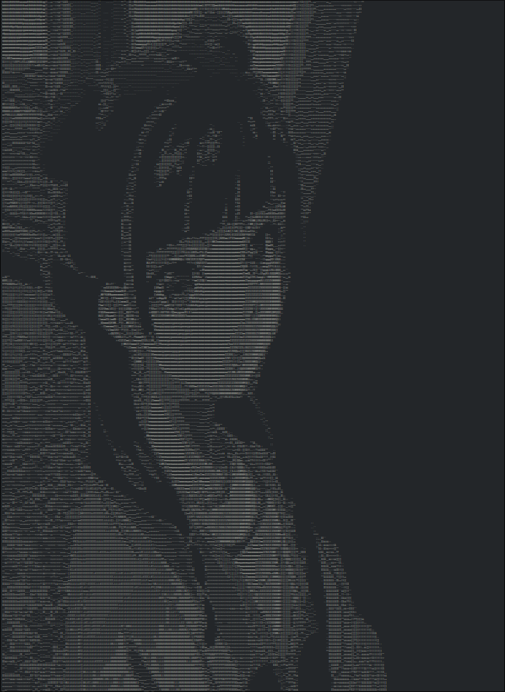

# Image to ASCII converter 

## **Usage**
- convert the selected image to .ppm format with GIMP. Lower the resolution to below 300x300
- place the image to input folder and rename the 'fname' to the filename without extensions.
- OR you can pass in the file name as the first argument in the executable. 

### *Original image*

> Converted to ASCII

### *Low res*

### *High res*

